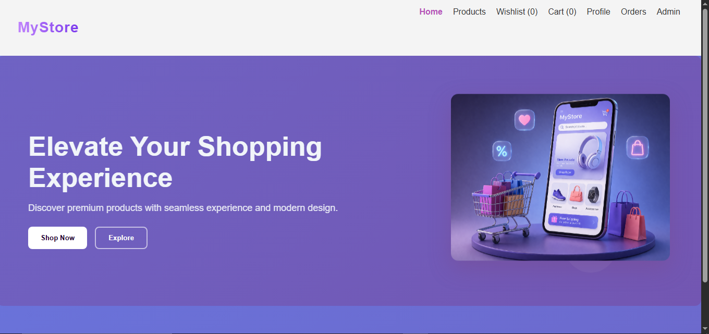
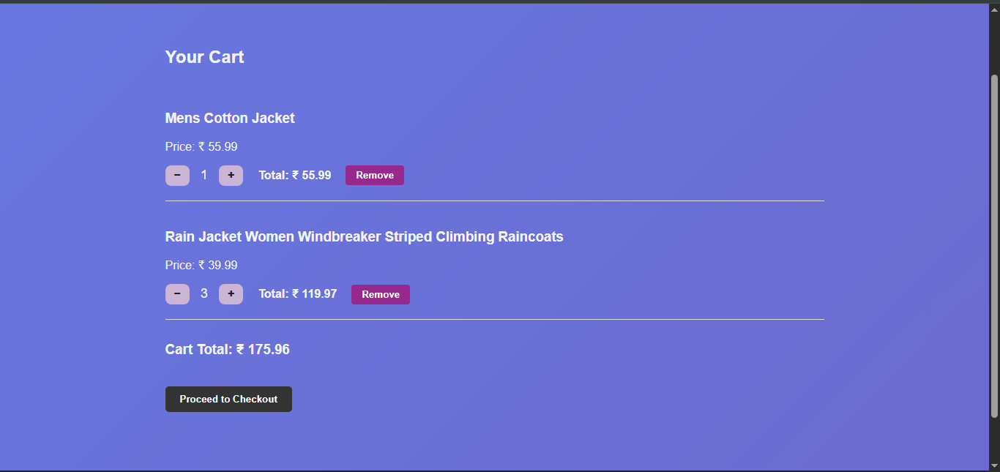
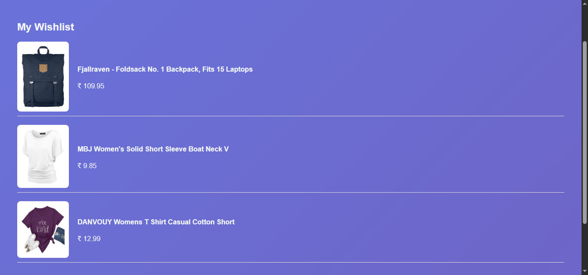
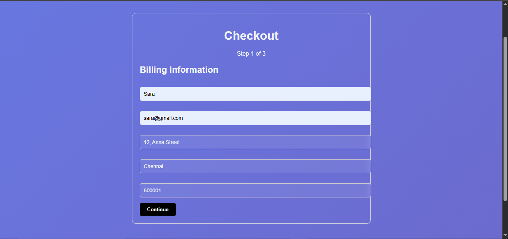
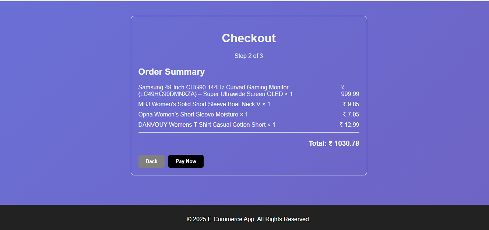
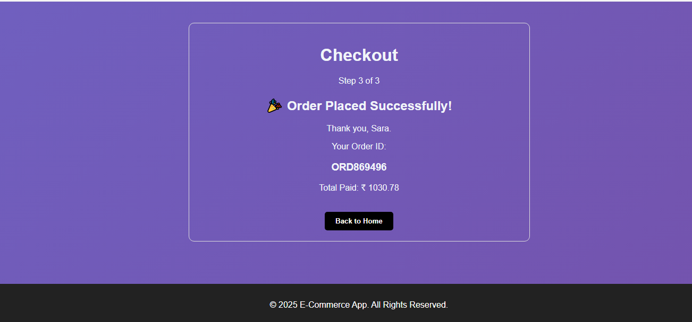

# 🛒 MyStore - E-Commerce React App

A modern, responsive eCommerce web application built using **React + Vite**, featuring cart management, wishlist, checkout flow, dark mode support, and API integration with FakeStore API.

---

## 🚀 Live Demo

🔗 Coming Soon (Deployment in progress)

---

## 📸 Screenshots

### 🏠 Home Page



### 🛒 Cart Page



### ❤️ Wishlist Page



### 💳 Checkout Flow

#### Step 1 – Address Details



#### Step 2 – Review / Shipping



#### Step 3 – Confirmation



---

## ✨ Features

* 🛍️ Product listing with search & pagination
* ❤️ Wishlist functionality
* 🛒 Cart with quantity management
* 💳 Multi-step checkout system
* 🔔 Toast notification system
* 📦 Order history (localStorage)
* 👤 Profile & settings (localStorage)
* 📊 Admin dashboard (basic KPIs)
* 📈 Analytics charts
* 🌙 Dark / Light mode toggle
* ⚡ API integration with caching
* 🧪 Unit + snapshot testing

---

## 🛠️ Tech Stack

* React
* Vite
* React Router DOM
* Context API / LocalStorage
* FakeStore API
* Vitest
* React Testing Library

---

## ⚙️ Installation & Setup

### 1. Clone repository

```bash
git clone <your-repo-url>
```

### 2. Install dependencies

```bash
npm install
```

### 3. Run development server

```bash
npm run dev
```

### 4. Build for production

```bash
npm run build
```

### 5. Preview production build

```bash
npm run preview
```

---

## 🔐 Environment Variables

Create a `.env` file in the root directory:

```
VITE_API_URL=https://fakestoreapi.com/products
```

---

## 🧪 Testing

Run test suite:

```bash
npm run test
```

Includes:

* Unit tests
* Snapshot tests

---

## 📁 Project Structure

```
src/
 ├── components/   # Reusable UI components (Navbar, ProductCard, etc.)
 ├── pages/        # Main pages (Home, Products, Cart, Checkout)
 ├── data/         # Static product data (if used)
 ├── services/     # API calls & data fetching logic
 ├── tests/        # Unit & snapshot tests
 ├── assets/       # Images & static files
 ├── context/      # Global state management (if used)
 ├── App.jsx       # Main app component
 └── main.jsx      # Entry point
```

---

## 🧩 Key Components

### ProductCard.jsx

* Displays product details
* Add to Cart functionality
* Wishlist toggle

### Cart.jsx

* Shows cart items
* Quantity update
* Total price calculation

### Checkout.jsx

* Multi-step checkout flow
* Order saving using localStorage

### Theme (Dark Mode)

* Toggle between light and dark mode
* Persistent theme using localStorage
* Global UI theme management

---

## 📦 Release Notes

### v1.0.0

* Product listing implemented
* Cart system added
* Wishlist feature added
* Checkout flow completed
* Dark mode implemented
* Basic admin dashboard added
* API integration completed
* Testing setup completed

---

## 🚧 Future Improvements

* 📱 Fully responsive UI improvements
* 💳 Payment gateway integration
* 🔗 Backend (Node.js / Firebase) integration
* 🔍 Advanced filters & sorting

---

## 🎯 Project Status

✔ Core features completed
✔ Dark mode implemented
✔ API integration working
✔ Testing implemented
✔ CI/CD stub added
✔ Ready for deployment

---

## 👨‍💻 Author

Built as part of a 30 Days internship training project using React + Vite.
